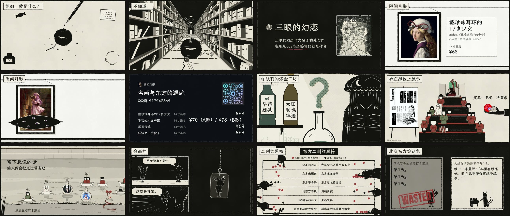

# 北交东方 · 百校天则 2026 摊位短片

北京交通大学东方Project摊位上循环播放的一部 4K 无声短片。全片 140 秒，分七段，像逛一场《图画展览会》：每一段是一件摊位上卖的制品或一个现场活动，段与段之间用转场接起来，首尾接成一个循环。

画面里的每一笔都是 JavaScript 在 Canvas 上逐帧画出来的：木刻墨块、刮痕白线、手写字、镜头运动都是代码，没有用图像生成模型。实拍素材只有制品照片、封面、头像和二维码。



## 看片

- **4K 成片：** 见 [Releases](../../releases)，3840×2160，24fps，139.7 秒。
- **浏览器直接放：** 双击 `animation/index.html`，地址后面加 `?booth` 会全屏自动循环，不需要网络。

## 七段

| # | 段 | 时长 | 讲什么 |
|---|---|---|---|
| 1 | 三眼的幻恋 | 28s | 钢笔滴墨成为觉之瞳，一路吃书长大；本子的售卖信息和封面 |
| 2 | 隙间月影 | 28s | 画廊墙上四幅名画 × 东方的艺术微喷，隙间扫过把原作换成东方版 |
| 3 | 帕秋莉的炼金工坊 | 16s | 现场调饮料、猜是哪些角色 |
| 4 | 雏 祭 | 19s | 做一个雏人偶、写上祝福、摆上台、放进河里流走 |
| 5 | 会赢的 | 12s | 黑白漫画分格的默片包袱，亚克力挂件 |
| 6 | 东方二创红黑榜 | 12s | 用小红点和小黑点给二创作品填表 |
| 7 | 北交东方笑话集 发布 | 24s | WASTED 淘汰赛，最后觉之瞳闭眼，墨收回钢笔，回到第 1 段 |

## 怎么做的

整部片由 [Claude Code](https://claude.com/claude-code) 里的 Claude Opus 5.5 写成，人负责定目的、画风和取舍。

1. **先定一段样板。** 第 1 段三眼先做完，定下木刻黑白、低饱和、手写楷体、线条每秒抖 8 次这套画风，写进 `docs/动画施工.md`。
2. **再并行施工。** 其余几段按文件拆包，每包一个 git worktree、一个 agent；段与段的交接画面由主会话先写进 `animation/kit.js`，各段只管自己的首尾。第一轮有几个 agent 中途停下，由 MiMo 接力收尾。
3. **审片返修。** Opus 5.5 逐段抽帧审片，列出问题（`docs/成片审查.html`），按文件再分五包并行返修。这一轮 agent 只按数值规格写、不看图，合并后由主会话逐像素比对七处交接帧、统一抽帧验收。
4. **出片。** Playwright 打开页面逐帧取图，分段并行交给 ffmpeg 编码成 4K MP4。

## 运行

需要 Node.js 18+ 和 ffmpeg。

```sh
npm install
npx playwright install chromium
node animation/tools/frames.mjs --q scene=sanyan --grid 36   # 抽一段的联系表到 out/anim/
node animation/tools/render.mjs                               # 渲染整片到 out/booth-4k.mp4
```

## 目录

```
animation/
  index.html, film.js    片子入口和时间线
  engine/core.js         逐帧引擎（时间曲线、随机数、画幅）
  kit.js                 画具：木刻墨块、刮痕线、纸纹、手写字、觉之瞳、段间交接画面
  scenes/1-…7-*.js       七段，每段一个文件
  fumo.js                雏祭转台上旋转的键山雏玩偶（小型正交 z-buffer 渲染器）
  photos.js              以 data URL 内嵌的素材（由 tools/make-photos.py 生成）
  tools/                 抽帧、渲染、素材打包
assets/                  素材和字体
source/                  原图备份
docs/                    方案、施工说明、成片审查
```

## 许可和版权

- **代码**（`animation/` 下的 JS、HTML 和工具脚本）：[MIT](LICENSE)。
- **字体：** 霞鹜文楷（LXGW WenKai）、Anton、小赖字体、Noto Sans SC、Noto Serif SC、Space Mono，均为 SIL Open Font License（霞鹜文楷、Anton、小赖的许可文件在 `assets/fonts/`）。
- **键山雏方块模型和贴图：** 来自 [TouhouLittleMaid](https://github.com/TartaricAcid/TouhouLittleMaid)，© tartaric_acid，CC BY-NC-SA 4.0（`source/hina/tlm/LICENSE-CC`）；由它转换而来的 `animation/data/hina-model.js` 按同一协议提供。
- **其余美术素材不在 MIT 范围内，版权归各自作者，仅供学习和展示，不得商用：**
  - 隙间月影的四幅作品：真菌_isomer、青未Q、amibazh 与隙间月影社团；对应的四幅原作名画为公有领域。
  - 《三眼的幻恋》封面：作者包子。
  - 北交东方各期摊宣、红黑榜实体表、主视觉：北交东方。
  - 漂流瓶里的头像、阿求吧唧：各自的作者和所有者。

东方Project 的角色和世界观版权归上海爱丽丝幻乐团（ZUN）。本片为同人作品。

## 相关

**[隙间月影 sukima-ml.club](https://sukima-ml.club)**：名画与东方的邂逅。第 2 段的四幅艺术微喷来自这个社团，可以在官网看作品、选尺寸和装裱。

---

**English.** A 140-second silent 4K loop for the Beijing Jiaotong University Touhou Project booth, structured like *Pictures at an Exhibition*: seven segments, one per item or activity at the booth. Every frame is drawn in Canvas 2D by JavaScript (woodcut ink blocks, scratched white lines, handwritten type, camera moves); no image-generation models were used. Written with Claude Opus 5.5 in Claude Code, with scenes built in parallel git worktrees. Code is MIT; artwork belongs to its respective creators and is not covered by the MIT license.
