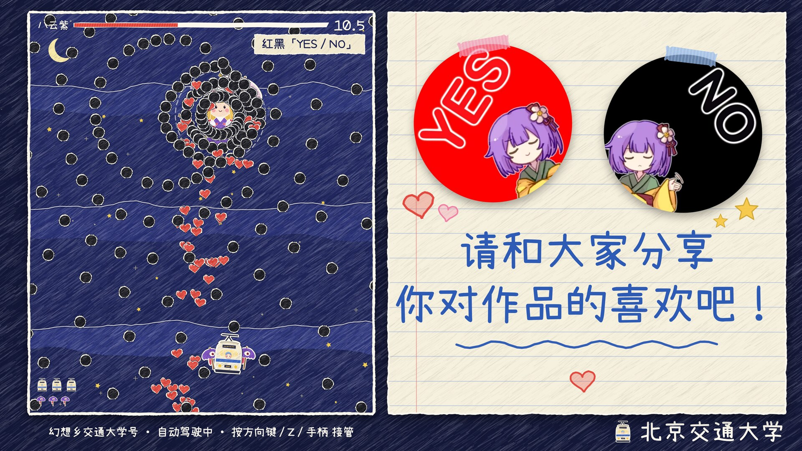

# 幻想乡交通大学号：剪纸弹幕演示

北京交通大学摊位 4K 屏的第二条线。东方式弹幕 STG 的无人值守演示：没人操作时 AI 自己躲弹（像东方的 replay），有人按键就接管，15 秒没输入交还 AI。每张符卡对应右侧一条摊位宣传，五张打完循环。画风与动画线同一个世界：深蓝卡纸夜空、蜡笔笔触、撕纸白边的彩色纸片子弹。



## 打开

双击 `game/index.html`（`file://` 直接跑，不联网，只用经典 `<script>` 和 `../vendor/pixi.min.js`）。浏览器全屏：Chrome 按 `⌃⌘F`（macOS）或 `F11`。舞台固定 3840×2160，任意窗口等比缩放。

## 按键

| 动作 | 键盘 | 手柄（标准布局） |
|---|---|---|
| 移动 | 方向键 / WASD | 左摇杆 / 十字键 |
| 低速（显示判定点） | Shift | LB / RB / LT / RT / X |
| 射击 | 玩家模式下自动连射；Z / J / 空格也算操作 | A |
| Bomb | X / K | B / Y |

任何一次按键或手柄动作都会立刻接管（底栏变黄，显示倒计时）；15 秒没有输入交还自动驾驶。没有 Game Over，残机用完自动续上。

## 查询参数

| 参数 | 作用 |
|---|---|
| `?card=1..5` | 从第几张符卡开始 |
| `?t=秒` | 启动时无渲染快进（从起始卡开始算） |
| `&pause=1` | 停住模拟，只渲染当前画面（截图用） |
| `?seed=` | 随机种子，默认 20260923；同种子同画面 |
| `?debug=1` | 左上角调试信息（帧、弹数、死亡、AI 状态）和判定圈 |
| `?rs=0.5` | 降低 WebGL 渲染分辨率（展位电脑带不动 4K 时用） |
| `?jitter=0` | 关掉手绘线条抖动（默认每个纸片 3 个变体按 8fps 轮换） |

`window.__game`：`step(n)`（无渲染推进 n 帧，返回摘要）、`deaths`、`bullets`、`maxBullets`、`card`（1..5）、`mode`（`'auto'|'player'`）、`stats`、`sim`。

## 符卡与宣传栏

| # | 符卡 | 设计意图 | 宣传栏 |
|---|---|---|---|
| 1 | 红黑「YES / NO」 | 吧唧的红与黑：红心花环顺时针转、停一下再朝自机飞来，黑弹花环逆时针转、出去后走波浪 | 笔记本纸上贴两枚真实吧唧，手写「请和大家分享你对作品的喜欢吧！」 |
| 2 | 厄符「流し雛」 | 雏的红、墨绿缎带组成旋转螺旋，反向三臂螺旋交错，灰色「厄」字混在里面慢慢漂走 | 摊宣 Vol.2 黑白漫画版式：黑块竖排「留下想说的话 / 雏人偶会把厄运带走吧——」 |
| 3 | 魔药「帕秋莉的炼金工坊」 | 场上三个问号药瓶各喷一种属性：火扇形扫射、水喷泉落雨、木旋转叶环，定时抛出会炸开的小药瓶 | 摊宣 Vol.3：标题、「猜猜魔药是由谁的魔力构成的 猜对了有奖励」、三个同款药瓶 |
| 4 | 境界「名画与东方的邂逅」 | 隙间在场地边缘开合，弹从裂缝里涌出；四段各用一幅名画的主色，Boss 放慢速结界环，最后一段 2000 发以上。耐久卡（Boss 不受伤，撑满 20 秒） | 照 sukima-ml 宣传册的编辑排版：暖白纸、墨色、细线、思源黑体、等宽标签，四幅作品与隙间同步轮换，规格价格表、官网、QQ 群、二维码。不用手写体、不贴胶带 |
| 5 | 宣符「会赢的」 | 黄红星星流，加上摊宣里黑底白字的「赢」字签 | 摊宣 Vol.1：「会赢的」、亚克力挂件 8元/套（包含两个单件）、两句对白 |

每张卡：宣言 cut-in 2.5 秒 + 攻击最多 20 秒 + 结算 1.8 秒。Boss 血量有一条随时间线性下降、16 秒到零的下限，所以无论 AI 还是真人都不会早于 16 秒收卡，每条宣传至少停约 20 秒。

## 验收脚本（仓库根目录执行）

```bash
node scripts/shot.mjs game/index.html "card=3&t=12&pause=1" out/game-c3.png 2500   # 4K 截图，控制台报错时退出码 1
node scripts/game-soak.mjs 10            # 无渲染跑满 10 分钟：死亡、被弹、Bomb、最大同屏弹数、每卡时长与覆盖
node scripts/game-takeover.mjs           # 键盘接管与 15 秒交还
node scripts/game-perf.mjs               # 本机真 GPU（Metal）4K：逐帧耗时 + 实时 6 秒帧率
/Users/fish2lab/Project/BX/.venv/bin/python scripts/game-fonts.py   # 改了屏上文字后重新裁字体
```

2026-09-23 在 MacBook Air M5 上的结果：

- soak 10 分钟 × 5 个种子（20260923 / 777 / 1 / 42 / 31337）：死亡 0，被弹 0，预防性 Bomb 1–2 次（都在魔药、境界两张卡），最大同屏 2088–2106 发，五张卡各出现 5–6 次。30 分钟单跑：死亡 0，被弹 0，Bomb 5（全在魔药卡），每张卡 20.4–24.3 秒。
- takeover：7 项全过（按 ArrowLeft 切到 player 且自机左移；按 Z 保持；无输入 14 秒仍是 player，超过 15 秒回到 auto；交还后再按 Z 能再接管）。
- perf（headless Chromium + Metal，3840×2160）：同屏 1567–2028 发的 300 帧，模拟一步 + 渲染 + 等 GPU 每帧 p50 0.4 ms、p95 0.5 ms、最慢 1.3 ms；实时运行 6 秒 60 fps、没有超过 20 ms 的帧，期间最大同屏 2088 发。

## 工程结构

| 文件 | 内容 |
|---|---|
| `util.js` | 舞台与场地坐标、种子随机数、配色、子弹外形表、按需注册的精灵表 |
| `art.js` | 全部程序化美术（canvas 2D）：蜡笔笔触、撕纸白边、子弹与特效图集、电车、唐伞、Q 版八云紫、阳伞、隙间、药瓶、夜空与桌面 |
| `cards.js` | 五张符卡 |
| `sim.js` | 确定性模拟：固定 60Hz、结构化数组子弹、事件（停顿后自机狙 / 分裂 / 加速）、自机、Bomb、被弹与复活、模式切换 |
| `ai.js` | 自动驾驶：17 个候选速度（8 方向 × 高低速 + 静止）× 两种计划，按真实运动学外推 30 帧计算碰撞代价，加 Boss 下方偏好位、靠墙惩罚、擦弹奖励、分级换向惩罚；所有计划都会在 3 帧内被弹时放 Bomb |
| `input.js` | 键盘与手柄 |
| `panels.js` | 宣传栏纸张、涂鸦、场地撕纸边框 |
| `render.js` | Pixi 场景（子弹、特效、自机弹用 ParticleContainer，单张图集）；DOM 的 HUD、cut-in、宣传栏切换、底栏 |
| `main.js` | 启动、查询参数、固定步长循环、`window.__game` |
| `fonts/` | 由 `scripts/game-fonts.py` 从 `assets/fonts/` 裁出的子集（小赖、思源黑体 Medium/Regular、思源宋体实例化到 900 字重），约 560KB |

照片、吧唧、摊宣、立绘都走 DOM ``（`file://` 下图片不能进 WebGL）；WebGL 里只有 canvas 生成的纹理。

## 已知问题与取舍

- 第 1 张卡的符卡名写成「红黑「YES / NO」」，没用任务里的「二创红黑榜」：素材事实要求屏上不出现「黑榜」，符卡名也在屏上。
- 北交摊宣三栏的粗体用思源宋体 900 字重（和摊宣原件的粗宋一致），没有用黑体。
- 隙间月影栏的小字：原作 / 角色 / 画师的标签、「数字典藏 ¥6.48 · 购买实物版免费附赠数字典藏」这一行约 38px，低于正文 80px；作品名 90px，原作 / 角色 / 画师的内容和价格 80px，主标题 184px。
- AI 偏保守：30 分钟 0 被弹。熟悉东方的人可能觉得弹幕偏好躲。AI 大约每秒一次完全反向（微躲），换方向约每秒 9 次。
- cut-in 立绘 `yukari-trim.webp` 的人物只有约 550×730 像素，显示 1000px 高，约放大 1.4 倍，边缘略软。
- 性能只在开发机（M5，headless Chromium + Metal）上量过，展位电脑未知；带不动时加 `?rs=0.5`。
- 手柄只按 Gamepad API 标准布局写了代码，没接真手柄测过。
- 无声音。
- 截图脚本用的是软件渲染（SwiftShader），画面与 GPU 渲染一致，但不代表帧率。
